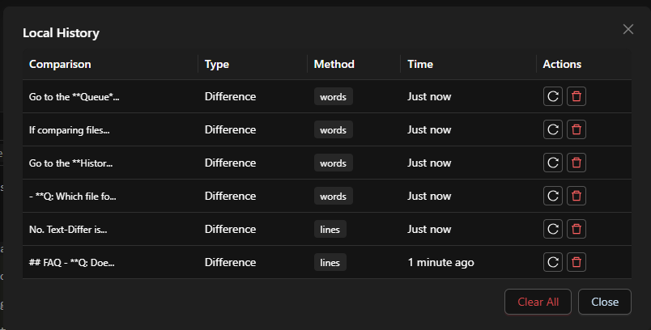

## FAQ

- **What is Text Differ and how does it work?**

Text Differ is an online text comparison tool that highlights differences between two pieces of text, code, or documents. It quickly detects added, removed, or modified content to help users review changes efficiently.

- **Is Text Differ a free diff checker?**

  Yes, Text Differ is a completely free diff checker that allows users to compare files, documents, and code without creating an account or installing any software.

- **Can I compare text online using Text Differ?**

  Yes. You can compare text online instantly with Text Differ. It supports source code, plain text, JSON, HTML, CSS, JavaScript, Python, and many other formats.

- **Where can I review my previous comparisons?**

  You can access all your recent comparisons from the Local History popup, where previous diff sessions are automatically stored for quick review and reuse.

  

- **How does Text Differ detect text difference accurately?**

  Text Differ uses advanced comparison algorithms to identify every text difference between two inputs. It highlights additions, deletions, and edits clearly, helping users save time and improve accuracy.