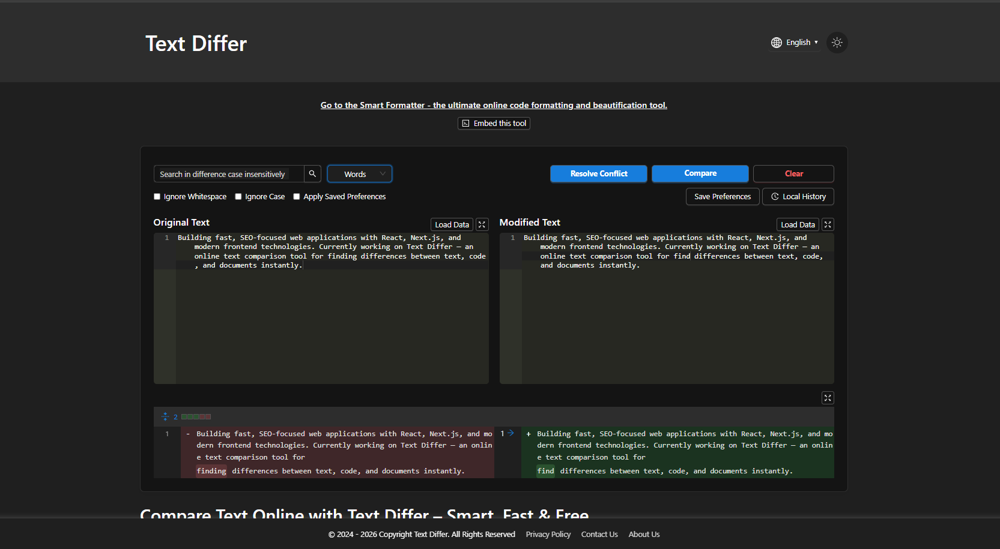
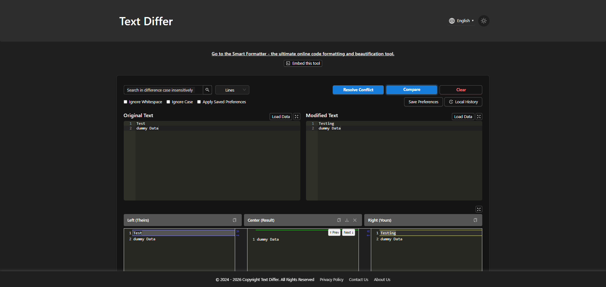
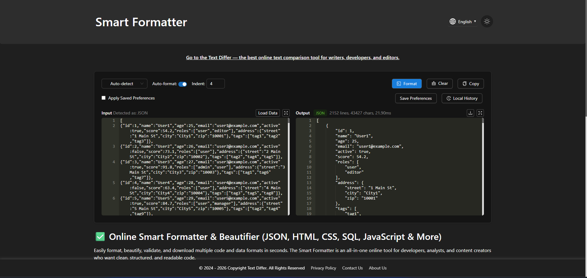

<i>"Text in. Differences out — 100% Private & Secure"</i>

  <a href="https://text-differ.com" style="margin-right: 15px;">
    <strong>🌐 Launch Text Compare →</strong>
  </a>
  <a href="https://text-differ.com/smart-formatter" style="margin-left: 15px;">
    <strong>✨ Launch Smart Formatter →</strong>
  </a>

  No download required • 100% private • Works in your browser

Latest Update:
- **Drag & Drop Support:** Drag-and-drop file comparison directly in the browser.
- **Virtualized diff rendering:** Smooth performance by loading only visible changes while scrolling large files.
- **Interactive Site Intro:** Built-in guided walkthrough to help new users quickly understand the comparison interface and features.

✨ Improvements:
- Optimized performance for documents.
- Refined dark mode contrast in side-by-side code blocks.
- Better performance and UI adjustments.

January 21, 2026
- Three-way merge view: Compare base, left, and right versions side-by-side.
- Copy/paste from clipboard with shortcut support.
- Compare from URL: Paste a link and Text Differ fetches and compares the content.

January 8, 2026
- Ignore whitespace mode: Focus on semantic changes only.
- Ignore case mode: Compare text without considering differences in letter casing
- Multi-language support: Available in multiple languages for a global user experience.

December 30, 2025
- Compare as text: Treat the entire content as plain text and compare it character by character.
- Compare as words: Split the content into words and compare based on word-level changes.
- Compare as lines: Split the content into lines and compare line-by-line differences.

---

## About Text-Differ

  <a href="./GUIDE.md"><strong>User Guide</strong></a> •
  <a href="./FAQ.md"><strong>FAQ</strong></a> •
  <a href="./USER_LETTER.md"><strong>User Letter</strong></a> •
  <a href="./PLATFORM_LETTER.md"><strong>Platform Letter</strong></a> •
  <a href="https://x.com/Text_Differ"><strong>Twitter</strong></a>

Comparing text shouldn't be painful. Text Differ is a fast, accurate, and privacy-focused web tool — helping you spot every change, whether you're reviewing code, editing contracts, or collaborating on documents. **No uploads to servers, no tracking, just reliable diffs right in your browser.**

### Side-by-Side Diff

### 3-Way-Merge

### Text Differ Features

| Feature              | Description                                                                           |
| -------------------- | ------------------------------------------------------------------------------------- |
| Side-by-Side Diff    | Visually compare differences side-by-side with color-coded highlighting.              |
| Format Comparison    | Supports line-based, word-based, and character-based comparison algorithms.           |
| File Upload          | Compare two files by dragging and dropping directly in browser.                       |
| Compare from URL     | Fetch and compare content from any public webpage.                                    |
| Ignore Options       | Toggle whitespace, case sensitivity, and line ending differences.                     |
| Dark/Light Mode      | Choose your preferred theme for comfortable viewing.                                  |
| History Logging      | View previous comparisons and restore them with a single click.                       |
| Three-Way Merge      | Resolve conflicts by comparing base, left, and right versions.                        |
| Expandable View      | Expand the text input fields or the diff result panel for a more spacious, comfortable comparison experience.                 |
| Revert Text          | Quickly undo any edits and return to your original text instantly.                    |
| Keyboard Shortcuts   | Navigate between changes quickly using hotkeys (e.g. Next / Prev change).             |
| Multi-Language Format| Inbuilt code formatters for JSON, XML, HTML, CSS, JavaScript, and SQL.                |
| No Sign-up Required  | Start comparing instantly — no account needed.                                        |

---

## Smart Formatter: Code & Data Formatter

In addition to text comparison, Text Differ now includes **Smart Formatter** — a powerful, all-in-one tool to beautify, validate, and format your code and data.

  

Clean, readable code is essential for debugging, sharing, and maintaining projects. Smart Formatter helps you instantly transform minified or messy code into properly indented, syntax-highlighted structures — **all locally in your browser**.

### Smart Formatter Features

| Feature                      | Description                                                                               |
| ---------------------------- | ----------------------------------------------------------------------------------------- |
| Multi-Format Support         | Format JSON, HTML, CSS, SQL, JavaScript, and more with a single tool.                     |
| Auto-Detect Format           | Automatically recognizes the code type — no manual selection required.                    |
| One-Click Beautify           | Add proper indentation and line breaks instantly.                                         |
| Error Detection              | Identify syntax issues or malformed structures in real time.                              |
| Upload or Fetch from URL     | Drag and drop a file, or paste a URL to fetch and format remote data.                     |
| Download Formatted File      | Save the beautified output as a file for offline use or sharing.                          |
| Copy & Share                 | Copy the formatted result to clipboard with one click.                                    |
| Expandable Editor & Output   | Expand input or output panels for a cleaner workspace with large code blocks.            |
| Preference Presets           | Save your settings (e.g., indent size, format type) for next time.                        |

### How to Use Smart Formatter

1. Paste, upload, or fetch your code from a URL in the input panel.
2. Choose a specific format (e.g., JSON, SQL) or use **Auto-Detect**.
3. Click **Format** to beautify the code.
4. Copy the output or download it as a file.

### Popular Use Cases

- **Developers:** Quickly debug API responses by formatting raw JSON.
- **Data Analysts:** Beautify SQL queries for better readability.
- **Students:** Learn proper code structure by comparing minified vs. formatted code.

---

## Star Us

We need your help to increase the visibility of Text-Differ and help more developers, editors, and lawyers audit their documents securely.

## Contact

We'd love your feedback!

📧 Email: text-differ@aavakar.com
🌐 Website: [https://text-differ.com](https://text-differ.com)
